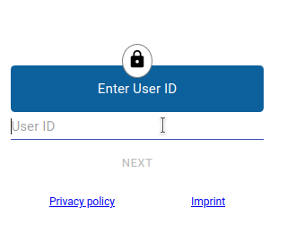
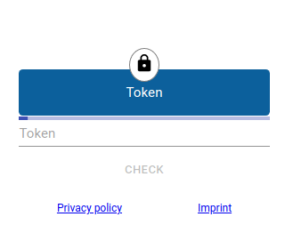
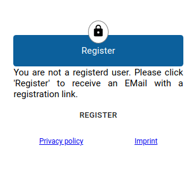
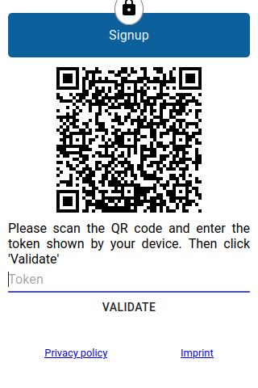
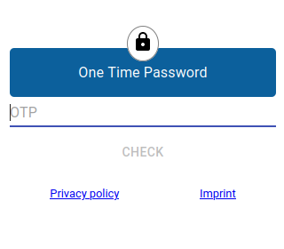
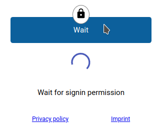
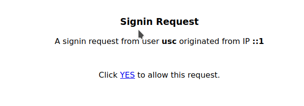

# Doorman

`doorman` is a reverse proxy to protect your internet ressources from beeing accessed.
It does not authenticate your users but only authorizes them by a second factor;
it is up to the protected ressource to have a separate authentication/authorization
layer.

`doorman` gives you the following options to authorize a request:

 - send a user a token (via webrequest, for example SMS)
 - register a user for the use of an authenticator app and request for an OTP
 - send the user a link with an **allow** action; no token required

To deliever a message to a user, `doorman` needs a trusted user backend. The
current version supports:

 - Constant list of users
 - File with users
 - LDAP Backend
 - OS command (shell script, etc.) which searches users

When a user confirms a request, `doorman` will whitelist your IP and
act as a normal reverse proxy and forward every request to the backend.
Browser requests will work with a cookie which checks the user **and** the
IP address; other requests (Rest-API's, ..) to the backend will be allowed if
their IP address is whitelisted.

As `doorman` is a plugin for [caddyserver](https://caddyserver.com), you can use
the configuration mechanisms of `caddy` to define backends; you can use load
balancing, use active/passive healthchcecks, etc.

## Whitelisting

`doorman` allows a request to the backend if the IP address of an incoming
request is whitelisted. To achive this goal `doorman` has static and dynamic
whitelistings. A **static** whitelisting is an IP or a CIDR which should always
be allowed to connect. `doorman` will forward request to the configured backend
without any interception.

In contrast to static whitelisting, the **dynamic** ones are created by
authorization requests from the users. If a user wants to access a ressource
which is not statically whitelisted, the user is prompted with a gate. After
confirming the user with some factor (token, otp, link) the IP address of the
user will be **dynamically** whitelisted for a specific duration (normally about
10 hours).

## Working modes

`doorman` has three different working modes. You can use `tokens`, `otp` or `links`
to confirm a request.

### Token mode

The *token mode* can be used to send the user a random token which must be entered
in the gateway. This token is only valid for a very short period of time (normally
60 secs). Your can configure the transport to be SMTP or a webrequest; so using
SMS is possible if you have a webservice which can be called to send a SMS.

You now have to enter your UID which will be search in all backends. If you
are found, the token will be transmitted to you. Depending on the transport you
configured you will receive an email or a SMS with a token.

### OTP Mode

Using OTP mode requires the users to have an app on their mobile phone installed.
When accessing a protected ressource, you will get the standard login:

If the user is a known ID but is not already registered for OTP usage, the user
will get a register dialog:

Clicking on "Register" will send the user a registration link which presents
the following dialog:

The user can now scan the QR code with an app and enter the token displayed by
the app. If the token is correct, the user is now registered and can now login
with an one time password:

> Please note that at the momemt there is no support for recovery codes. If
> you have lost your mobile or your registration an administrator must delete
> your registration.

### Link mode

Both `token` and `otp` mode require the user to enter some values. The `link`
mode instead sends the user a confirmation link while the login screen waits
for the confirmation. First you have to login:

But now you will be presented with a wait dialog:

The user will receive an email or another type of message (SMS) which contains a
confirmation link. When this link is clicked, the system opens a new page with
the following content:

When clicking "YES", the **wait dialog** disappears and the user can access the
upstream service.

## Configuration options

| Option | Value |
|--------|-------|
| `imprint_url`| If set, this will be rendered as a link to an imprint in the login page|
| `privacy_policy_url`| If set, this will be rendered as a link to a privacy policy page|
| `spacing` | when in `token` mode, the token will be intersected with this character|
| `issuer` | The `issuer` is the name of this instance. |
| `issuer_base`| This is a base URL with scheme and hostname which is used for the login/auth pages and is never forwarded to an upstream|
| `token_duration`| The duration as a `go` duration string which indicates how long a token/link is valid, default=60s|
| `access_duration`| The duration as a `go` duration which indicates how long one can access the upstream, default=10h |
| `operation_mode`| Se upper description of different modes (`token`, `otp` and `link`|
| `users`| list of user backend plugins (see below)|
| `whitelist`| list of whitelist plugins (see below)|
| `cookie_block`| |
| `cookie_hash`| |
| `insecure_cookie`| |
| `messenger_config`| |
| `store_settings`| |

### User backends plugins

### Whitelist backends plugins

### Messenger plugins

# Runtime dependencies

To support installations in clusters (like K8S), `doorman` needs a central store
which is accessible for every running instance. This store is implemented by
a redis KV store. All dynamic whitelistings are stored in redis and cached in
a `doorman` instance, so it does not matter on which instance you have created
your signin request.

It is up to you to have a stable redis installation. You can use a single instance
(because redis is very stable imho) or you can install a cluster solution which
is supported by redis.

# Security considerations

One might think it is not secure enough to allow every client IP address when
the user confirms a request. This is correct, and this is why your protected
ressouces **must have an authorization/authentication** layer!

Many users have a reverse proxy (like nginx) and configures static IP/CIDR entries
which are allowed to access the upstream services. This works for companies with
fixed IP addresses, but it failes if your company does not have fixed IP's or
your employees (or customers) work in their homeoffice. In this case their  IP
will change constantly

Think of `doorman` as a service which manages a list of IP addresses which is
allowed to access services. Only your network connection is authorized; if you
are not the only one which uses the network connection, every one in the same
network will have access to the upstream.

